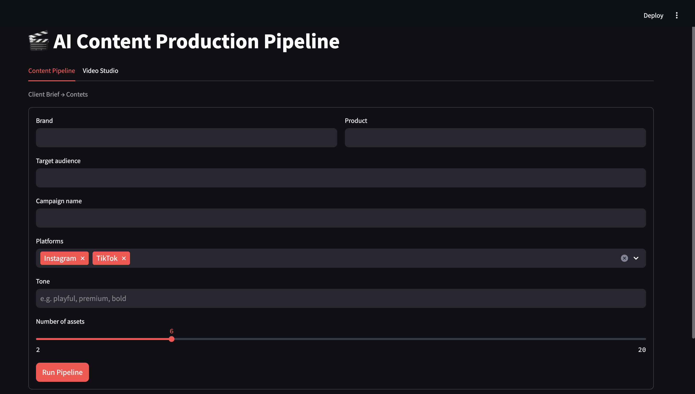
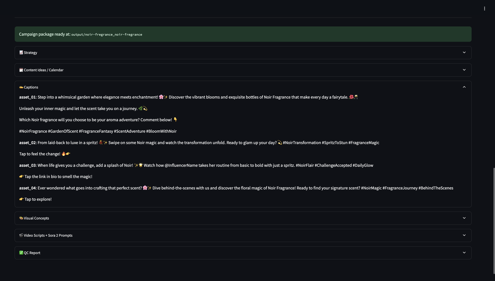
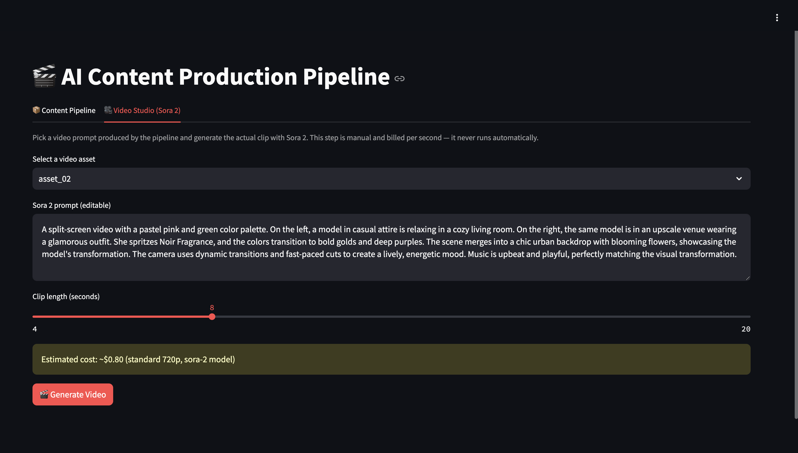

# Multi-Agent AI Content Production Pipeline

This project orchestrates a chain of specialized AI agents with **LangGraph** to convert a client brief into a ready-to-use campaign package: strategy, content calendar, captions, visual concepts, generated images, and video scripts with Sora 2 prompts. A **Streamlit** interface provides the brief form, a live agent activity log, and a separate Video Studio for manual video generation.

## Screenshots


*Client brief form*


*Live agent activity log*


*Strategy, captions, visual concepts and generated images*


*Video Studio: manual Sora 2 video generation*

## Features

- Nine-step agent pipeline built on LangGraph (`StateGraph`) with shared state passed between agents
- Image generation with DALL·E 3, saved as PNG files
- Scene-by-scene video scripts with timing, on-screen text, audio direction and a ready-to-use Sora 2 prompt
- Video Studio: a separate, manual tab that renders an actual `.mp4` from any generated Sora 2 prompt
- QC agent that reviews tone consistency and campaign coherence
- Structured output folder per campaign, including a `manifest.json`
- Live agent activity log in the UI

## Architecture

```
Client Brief
    |
Strategy Agent         positioning, key messages, content pillars
    |
Ideation Agent         content ideas and calendar (image or video per asset)
    |
Copy Agent             platform-native captions
    |
Visual Concept Agent   composition, mood, palette, style
    |
Image Prompt Agent     DALL·E 3 prompts for image assets
    |
Video Script Agent     scene-by-scene script and Sora 2 prompt for video assets
    |
Image Generation       PNG files via DALL·E 3
    |
QC Agent               consistency and coherence report
    |
Packaging Agent        writes the final campaign folder
```

Video generation is intentionally **not** part of the automatic pipeline. It is billed per second, so it runs only on demand from the Video Studio tab.

## Project Structure

```
multi-agent-content-pipeline/
├── app.py                  # Streamlit UI (Pipeline and Video Studio tabs)
├── agents/                 # One module per agent
├── graph/
│   ├── state.py            # Shared state definition
│   └── workflow.py         # LangGraph workflow
├── prompts/                # System and user prompt templates
├── services/
│   ├── image_service.py    # DALL·E 3 wrapper
│   └── video_service.py    # Sora 2 wrapper (Video Studio only)
├── utils/                  # Config, logger, file manager
├── tests/
├── docs/screenshots/       # README images
└── output/                 # Generated campaigns (gitignored)
```

## Output Example

```
output/brand_campaign/
├── strategy/strategy.md
├── content_calendar/calendar.json
├── captions/captions.md
├── visual_prompts/
│   ├── visual_concepts.md
│   └── image_prompts.md
├── images/                 # asset_01.png, ...
├── video_scripts/          # asset_02.md (script + Sora 2 prompt), ...
└── final_assets/
    ├── qc_report.md
    ├── manifest.json
    └── videos/             # .mp4 files from Video Studio
```

## Getting Started

**Requirements:** Python 3.10+ and an OpenAI API key.

```bash
# 1. Clone the repository
git clone https://github.com/elfakb/multi-agent-content-pipeline.git
cd multi-agent-content-pipeline

# 2. Create a virtual environment (recommended)
python -m venv venv
source venv/bin/activate        # Windows: venv\Scripts\activate

# 3. Install dependencies
pip install -r requirements.txt

# 4. Configure your API key
cp .env.example .env
# Edit .env and set: OPENAI_API_KEY=your_key_here

# 5. Run the app
streamlit run app.py
```

## Usage

1. In the **Content Pipeline** tab, fill in the brief: brand, product, audience, campaign, platforms, tone and number of assets.
2. Click **Run Pipeline** and follow progress in the activity log.
3. Review the strategy, captions, visual concepts, generated images and video scripts.
4. Optionally, open **Video Studio**, select a video asset, edit the Sora 2 prompt, set the duration and click **Generate Video**.

## Cost Notes

- Text (GPT-4o) and image (DALL·E 3) requests are billed by OpenAI per request.
- Sora 2 is billed per second of generated video. It is isolated in Video Studio and never runs automatically. The UI displays an estimated cost before generation.
- Sora 2 API access requires a paid OpenAI account with a sufficient usage tier. Pricing and API parameters may change, so check the current OpenAI documentation.

## Tech Stack

Python, LangGraph, OpenAI API (GPT-4o, DALL·E 3, Sora 2), Streamlit, Pillow

## Testing

```bash
pytest -m integration
```

Integration tests make real, billed API calls.

---

# Türkçe

## Genel Bakış

Bu proje, **LangGraph** ile birbirine bağlanan uzman AI ajanları kullanarak bir müşteri brief'ini kullanıma hazır bir kampanya paketine dönüştürür: strateji, içerik takvimi, caption'lar, görsel konseptler, üretilmiş görseller ve Sora 2 promptlu video senaryoları. **Streamlit** arayüzü; brief formunu, canlı ajan aktivite logunu ve manuel video üretimi için ayrı bir Video Studio sekmesini sunar.

## Ekran Görüntüleri


*Müşteri brief formu*


*Canlı ajan aktivite logu*


*Strateji, caption'lar, görsel konseptler ve üretilen görseller*


*Video Studio: manuel Sora 2 video üretimi*

## Özellikler

- LangGraph (`StateGraph`) üzerine kurulu, ajanlar arasında ortak state taşıyan dokuz adımlı pipeline
- DALL·E 3 ile görsel üretimi, PNG olarak kaydedilir
- Süre, ekran yazısı ve ses yönlendirmesi içeren sahne sahne video senaryoları ve kullanıma hazır Sora 2 promptu
- Video Studio: üretilen herhangi bir Sora 2 promptundan gerçek `.mp4` üreten, ayrı ve manuel bir sekme
- Ton tutarlılığını ve kampanya bütünlüğünü inceleyen QC ajanı
- Her kampanya için `manifest.json` dahil düzenli çıktı klasörü
- Arayüzde canlı ajan aktivite logu

## Mimari

```
Müşteri Brief'i
    |
Strategy Agent         konumlandırma, ana mesajlar, içerik sütunları
    |
Ideation Agent         içerik fikirleri ve takvim (her asset için görsel veya video)
    |
Copy Agent             platforma uygun caption'lar
    |
Visual Concept Agent   kompozisyon, mood, renk paleti, stil
    |
Image Prompt Agent     görsel asset'ler için DALL·E 3 promptları
    |
Video Script Agent     video asset'ler için sahne sahne senaryo ve Sora 2 promptu
    |
Image Generation       DALL·E 3 ile PNG dosyaları
    |
QC Agent               tutarlılık ve bütünlük raporu
    |
Packaging Agent        final kampanya klasörünü yazar
```

Video üretimi bilinçli olarak otomatik pipeline'a **dahil edilmemiştir**. Saniye başı ücretlendirildiği için yalnızca Video Studio sekmesinden, istek üzerine çalışır.

## Proje Yapısı

```
multi-agent-content-pipeline/
├── app.py                  # Streamlit arayüzü (Pipeline ve Video Studio sekmeleri)
├── agents/                 # Her ajan için ayrı modül
├── graph/
│   ├── state.py            # Ortak state tanımı
│   └── workflow.py         # LangGraph workflow'u
├── prompts/                # System ve user prompt şablonları
├── services/
│   ├── image_service.py    # DALL·E 3 wrapper
│   └── video_service.py    # Sora 2 wrapper (sadece Video Studio)
├── utils/                  # Config, logger, dosya yöneticisi
├── tests/
├── docs/screenshots/       # README görselleri
└── output/                 # Üretilen kampanyalar (gitignore'da)
```

## Çıktı Örneği

```
output/marka_kampanya/
├── strategy/strategy.md
├── content_calendar/calendar.json
├── captions/captions.md
├── visual_prompts/
│   ├── visual_concepts.md
│   └── image_prompts.md
├── images/                 # asset_01.png, ...
├── video_scripts/          # asset_02.md (senaryo + Sora 2 promptu), ...
└── final_assets/
    ├── qc_report.md
    ├── manifest.json
    └── videos/             # Video Studio'dan gelen .mp4 dosyaları
```

## Kurulum

**Gereksinimler:** Python 3.10+ ve bir OpenAI API anahtarı.

```bash
# 1. Repoyu klonla
git clone https://github.com/elfakb/multi-agent-content-pipeline.git
cd multi-agent-content-pipeline

# 2. Sanal ortam oluştur (önerilir)
python -m venv venv
source venv/bin/activate        # Windows: venv\Scripts\activate

# 3. Bağımlılıkları yükle
pip install -r requirements.txt

# 4. API anahtarını ayarla
cp .env.example .env
# .env dosyasını düzenle ve şunu gir: OPENAI_API_KEY=anahtarin

# 5. Uygulamayı çalıştır
streamlit run app.py
```

## Kullanım

1. **Content Pipeline** sekmesinde brief'i doldur: marka, ürün, hedef kitle, kampanya, platformlar, ton ve asset sayısı.
2. **Run Pipeline**'a bas ve ilerlemeyi aktivite logundan takip et.
3. Strateji, caption'lar, görsel konseptler, üretilen görseller ve video senaryolarını incele.
4. İsteğe bağlı olarak **Video Studio**'yu aç, bir video asset seç, Sora 2 promptunu düzenle, süreyi ayarla ve **Generate Video**'ya bas.

## Maliyet Notları

- Metin (GPT-4o) ve görsel (DALL·E 3) istekleri OpenAI tarafından istek başına ücretlendirilir.
- Sora 2, üretilen video saniyesi başına ücretlendirilir. Video Studio'da izole edilmiştir ve asla otomatik çalışmaz. Arayüz, üretimden önce tahmini maliyeti gösterir.
- Sora 2 API erişimi için yeterli kullanım seviyesine sahip ücretli bir OpenAI hesabı gerekir. Fiyatlar ve API parametreleri değişebilir, güncel OpenAI dokümantasyonunu kontrol et.

## Teknolojiler

Python, LangGraph, OpenAI API (GPT-4o, DALL·E 3, Sora 2), Streamlit, Pillow

## Testler

```bash
pytest -m integration
```

Entegrasyon testleri gerçek ve ücretli API çağrıları yapar.

## Yol Haritası

- [ ] Ajanlar arasında insan onay adımları (human-in-the-loop)
- [ ] QC tarafından tetiklenen revizyon döngüsü
- [ ] Ek görsel ve video sağlayıcı desteği
- [ ] Kampanya paketini ZIP olarak dışa aktarma

## Lisans

MIT Lisansı ile yayımlanmıştır. Ayrıntılar için `LICENSE` dosyasına bakın.
````

Ekran görüntülerinin görünmesi için şunları yapman gerekir:

1. Proje klasöründe `docs/screenshots/` klasörünü oluştur.
2. Görüntüleri şu adlarla kaydet (ya da README'deki yolları kendi dosya adlarına göre değiştir):
   - `01-brief-form.png` (brief formu)
   - `02-activity-log.png` (ajan aktivite logu)
   - `03-results.png` (strateji, caption ve görsel sonuçları)
   - `04-video-studio.png` (Video Studio sekmesi)
3. Kaç ekran görüntün varsa o kadar `![...]` satırı bırak, fazlasını sil. Dosya adları büyük/küçük harfe duyarlıdır, README'deki adlarla birebir aynı olmalı.
4. Push'tan önce `git status` ile `.env` dosyasının listede olmadığını kontrol et.

README MIT lisansına atıf yapıyor. Repoya bir `LICENSE` dosyası eklemezsen GitHub'da "Add file > Create new file" ile `LICENSE` yazıp çıkan şablonlardan MIT'yi seçebilirsin. Lisans eklemeyeceksen iki dildeki lisans bölümlerini sil.